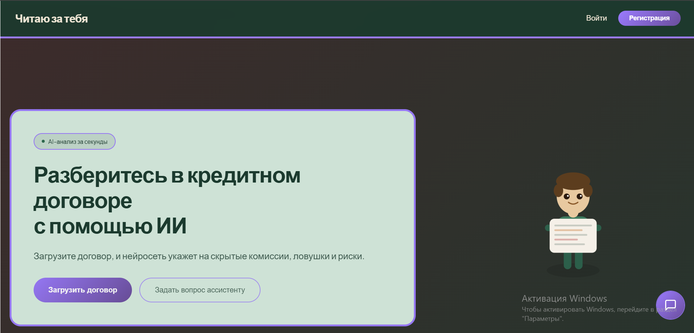

# Читаю за тебя 📄

**AI-веб-приложение для умного анализа кредитных договоров на русском языке.**

[](https://reactjs.org/)
[](https://vitejs.dev/)
[](https://vercel.com)

Приложение помогает разобраться в сложных кредитных документах: от выделения ключевых рисков до сравнения нескольких предложений.

🔗 **ссылка на сайт:** https://hackathonap.vercel.app/ — попробуйте прямо сейчас!



## ✨ Возможности

*   **Загрузка любых форматов:** Поддерживает PDF, DOCX, TXT и даже изображения/сканы (OCR).
*   **Умный анализ:** Выявляет скрытые комиссии, неочевидные условия и потенциальные риски в договоре.
*   **Сравнение предложений:** Наглядная таблица и графики (Recharts) для выбора лучшего кредита.
*   **AI-ассистент:** Задайте уточняющий вопрос по договору в чате.

## 🚀 Как это работает (быстрый старт)

### Установка и запуск

1.  **Клонируйте репозиторий:**
    ```bash
    git clone https://github.com/DariaBoitsova/hackathon.git
    cd hackathon
    ```
2.  **Установите зависимости:**
    ```bash
    npm install
    ```
    *(В проекте есть `package.json` и `package-lock.json`)*
3.  **Настройте переменные окружения:**
    Создайте файл `.env.local` в корне проекта и добавьте ваш API-ключ от OpenRouter (или другого поддерживаемого провайдера):
    ```env
    DEEPSEEK_API_KEY=ваш_ключ_сюда
    # Или GEMINI_API_KEY, или GOOGLE_API_KEY
    ```
4.  **Запустите проект локально:**
    ```bash
    npm run dev
    ```
    Приложение будет доступно по адресу `http://localhost:5173` (или другому, который укажет Vite).

### Технологический стек

| Компонент       | Технологии                                                                                              |
|-----------------|---------------------------------------------------------------------------------------------------------|
| **Frontend**    | React, Vite, Recharts                                                                                   |
| **Обработка документов** | Tesseract.js (OCR), pdfjs-dist, Mammoth (на клиенте и сервере)                                         |
| **Backend**     | Vercel Serverless Function (`api/chat.js`), Busboy (парсинг `multipart/form-data`)                       |
| **AI**          | OpenRouter API (прокси до различных LLM)                                                                |

## 📁 Структура проекта

```
.
├── api/                    # Serverless функции для Vercel
│   └── chat.js             # Основной API эндпоинт для общения с AI
├── src/                     # Исходный код фронтенда
│   ├── App.jsx              # Главный компонент приложения
│   └── main.jsx             # Точка входа React
├── index.html               # Основной HTML файл
├── vite.config.js           # Конфигурация Vite
├── package.json             # Зависимости и скрипты
└── README.md                # Этот файл
```


### 🛠 Планы по доработке
*   Добавить недостающий `api/generate-pdf`.
*   Унифицировать схему данных для сравнения кредитов.
*   Исправить отправку сообщений из предложенных вариантов.
*   Перенести авторизацию на сервер (сессии, JWT, безопасное хеширование).


**Сделано с ❤️ для хакатона**


### Что было улучшено
*   **Визуальная структура:** Добавлены эмодзи, бейджи технологий, четкие разделы и таблицы.
*   **Инструкции по запуску:** Шаги детализированы и включают установку из существующего `package.json`.
*   **Четкость описания:** Заголовки отражают суть, сложные моменты (например, Known Issues) выделены иконками.
*   **Призыв к действию:** Добавлен раздел "Как помочь проекту", что поощряет коллаборацию.
*   **Акцент на проблемах:** Список известных проблем стал нагляднее, что полезно и для вас, и для контрибьюторов.
